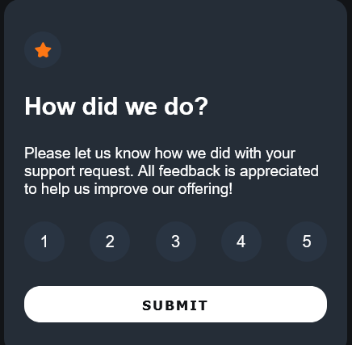

# Frontend Mentor - Interactive rating component solution

This is a solution to the [Interactive rating component challenge on Frontend Mentor](https://www.frontendmentor.io/challenges/interactive-rating-component-koxpeBUmI). Frontend Mentor challenges help you improve your coding skills by building realistic projects. 


### Screenshot


### Links

- Solution URL: [Add solution URL here](https://your-solution-url.com)
- Live Site URL: [Add live site URL here](https://your-live-site-url.com)


## My process

### Built with

- Semantic HTML5 markup
- CSS custom properties
- Flexbox
- Mobile-first workflow
- Inject HTML with JS

### What I learned

```js
    function runInitialState() {
    const ratingCard = document.querySelector('.card');

    // initial state of card
    ratingCard.innerHTML =
    `
        
        <h3 class="card__heading">How did we do?</h3>
        <p class="card__context">
            Please let us know how we did with your support request. All feedback is appreciated to help us improve our offering!
        </p>
        <div class="card__buttons">
            <button>1</button>
            <button>2</button>
            <button>3</button>
            <button>4</button>
            <button>5</button>
        </div>
        <button class="card__submit-btn">Submit</button>
    `
;
}
// creates card component on DOM load
runInitialState();
```